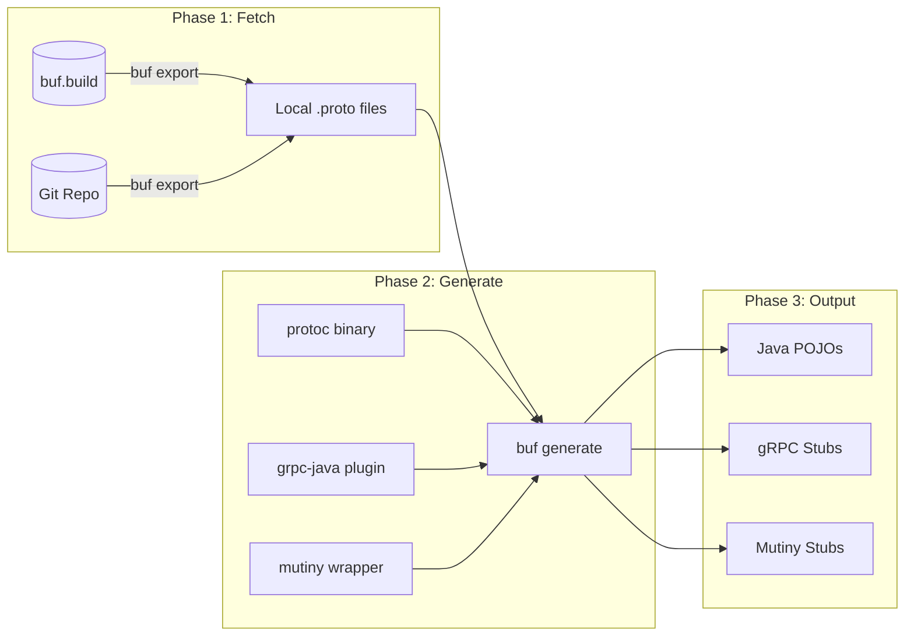
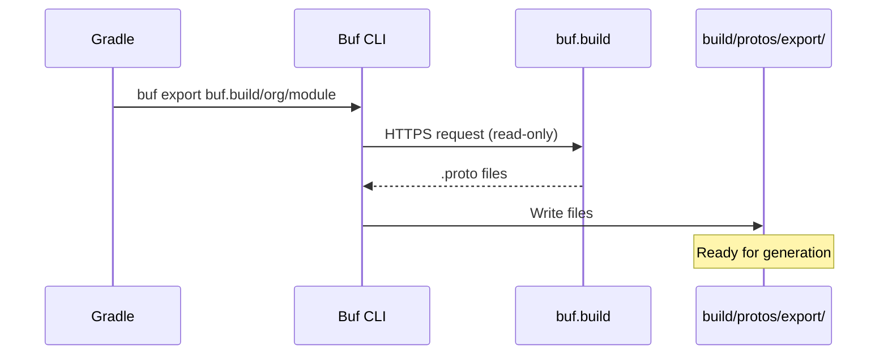
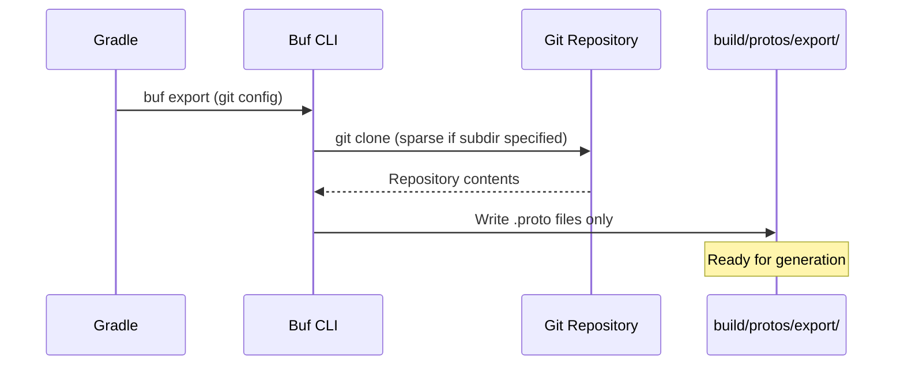
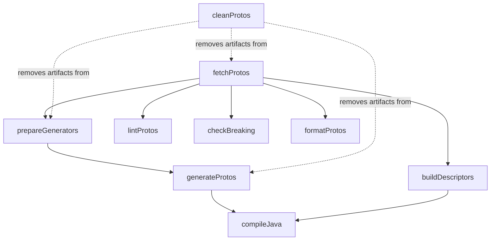

# Pipestream Proto Toolchain Guide

## Table of Contents

1. [Introduction](#1-introduction)
2. [Quick Start](#2-quick-start)
3. [Examples](#3-examples)
4. [Configuration Reference](#4-configuration-reference)
5. [Proto Sources: BSR vs Git](#5-proto-sources-bsr-vs-git)
6. [Binary Management](#6-binary-management)
7. [Gradle Tasks Reference](#7-gradle-tasks-reference)
8. [Troubleshooting](#8-troubleshooting)

---

## 1. Introduction

The **Pipestream Proto Toolchain** (`ai.pipestream.proto-toolchain`) is a Gradle plugin that simplifies Protocol Buffer code generation for Java projects. It replaces dozens of lines of manual task wiring with a clean, declarative DSL.

The plugin fetches `.proto` files from either the Buf Schema Registry (BSR) or Git repositories, then generates Java POJOs, gRPC stubs, and Quarkus Mutiny reactive stubs—all using **100% local code generation**. No proto files are ever uploaded to external servers, making it safe for enterprise environments with strict data governance requirements.

### Key Benefits

- **Declarative**: Define what you need, not how to get it
- **Flexible**: Switch between BSR and Git sources with a single flag
- **Secure**: All code generation happens locally (no data exfiltration)
- **Hermetic**: All binaries downloaded from Maven Central (no PATH dependencies)
- **Automatic**: Task wiring and sourceSet configuration handled for you

### How It Works



All binaries (`buf`, `protoc`, `protoc-gen-grpc-java`) are automatically downloaded from Maven Central. The Quarkus Mutiny generator is wrapped in a shell script that the plugin creates dynamically.

---

## 2. Quick Start

Add the plugin to your `build.gradle`:

```groovy
plugins {
    id 'java'
    id 'ai.pipestream.proto-toolchain' version '1.0.0'
}

repositories {
    mavenCentral()
}

pipestreamProtos {
    modules {
        register("mymodule") {
            bsr = "buf.build/yourorg/yourmodule"
        }
    }
}
```

This minimal configuration does the following:
- Downloads the `buf` CLI, `protoc`, and `protoc-gen-grpc-java` from Maven Central
- Fetches your proto files from the BSR module `buf.build/yourorg/yourmodule`
- Generates Java POJOs, gRPC stubs, and Mutiny stubs
- Adds the generated sources to your main sourceSet
- Wires everything into `compileJava` automatically

### Run Your First Build

```bash
./gradlew build
```

That's it. Your generated Java files will be in `build/generated/source/proto/main/java`.

### What Just Happened?

Behind the scenes, the plugin executed three tasks:

1. **`fetchProtos`** - Downloaded `.proto` files from BSR to `build/protos/export/mymodule/`
2. **`prepareGenerators`** - Downloaded binaries, created `buf.gen.yaml` with local plugin paths
3. **`generateProtos`** - Ran `buf generate` to create Java source files

The `compileJava` task automatically depends on these, so you don't need to wire anything manually.

---

## 3. Examples

### 3.1 Single Module from BSR

The simplest case—one proto module from the Buf Schema Registry:

```groovy
pipestreamProtos {
    modules {
        register("intake") {
            bsr = "buf.build/pipestreamai/intake"
        }
    }
}
```

The module name (`"intake"`) is used to organize exported files under `build/protos/export/intake/`. You can name it anything meaningful to your project.

### 3.2 Multiple Modules

Register multiple modules when your project depends on several proto packages:

```groovy
pipestreamProtos {
    modules {
        register("intake") {
            bsr = "buf.build/pipestreamai/intake"
        }
        register("admin") {
            bsr = "buf.build/pipestreamai/admin"
        }
        register("common") {
            bsr = "buf.build/pipestreamai/common"
        }
    }
}
```

Each module is exported to its own subdirectory, then all are processed together during generation. This keeps your proto dependencies organized and makes it easy to see which modules your project uses.

### 3.3 Git Source for Restricted Environments

For environments that cannot access `buf.build`, configure Git fallback:

```groovy
pipestreamProtos {
    modules {
        register("intake") {
            // Primary source (used by default)
            bsr = "buf.build/pipestreamai/intake"

            // Fallback source (used with -PprotoSource=git)
            gitRepo = "https://github.com/pipestreamai/pipestream-protos.git"
            gitRef = "main"        // Can be branch, tag, or commit SHA
            gitSubdir = "intake"   // Subdirectory within the repo (for monorepos)
        }
    }
}
```

Now you can build from either source:

```bash
# Default: fetch from BSR
./gradlew build

# Restricted environment: fetch from Git
./gradlew build -PprotoSource=git
```

The generated code is identical regardless of source. This lets you develop against BSR (fast, cached) while giving restricted clients a fully self-contained build.

### 3.4 Disabling Mutiny or gRPC Generation

Not every project needs all stub types. Disable what you don't need:

```groovy
pipestreamProtos {
    // Only generate Java POJOs (no gRPC, no Mutiny)
    generateGrpc = false
    generateMutiny = false

    modules {
        register("models") {
            bsr = "buf.build/pipestreamai/models"
        }
    }
}
```

This is useful for shared model libraries that don't need service stubs, or for projects using a different reactive framework.

### 3.5 Adding Extra Buf Plugins

Extend generation with additional Buf plugins. Here's an example adding documentation generation:

```groovy
pipestreamProtos {
    modules {
        register("api") {
            bsr = "buf.build/pipestreamai/api"
        }
    }

    extraPlugins {
        register("doc") {
            plugin = "buf.build/community/pseudomuto-protoc-gen-doc"
            out = "build/docs/proto"
            opt = ["markdown,api.md"]
        }
    }
}
```

Extra plugins are appended to the generated `buf.gen.yaml`. Note that these may use remote execution on BSR—check the plugin's documentation if data privacy is a concern.

### 3.6 Custom Output Directories

Override the default output locations:

```groovy
pipestreamProtos {
    // Generated Java sources
    outputDir = layout.buildDirectory.dir("generated/source/proto/main/java")

    // Descriptor file (for reflection/dynamic message handling)
    descriptorPath = layout.buildDirectory.file("descriptors/proto.desc")

    modules {
        register("api") {
            bsr = "buf.build/pipestreamai/api"
        }
    }
}
```

The `outputDir` is automatically added to your main sourceSet, so IDEs will recognize the generated code.

---

## 4. Configuration Reference

### Source Configuration

| Property | Type | Default | Description |
|----------|------|---------|-------------|
| `sourceMode` | `String` | `'bsr'` | Proto source mode: `'bsr'` or `'git'`. Can be overridden with `-PprotoSource=git` |

### Version Configuration

| Property | Type | Default | Description |
|----------|------|---------|-------------|
| `bufVersion` | `String` | `'1.61.0'` | Buf CLI version to download from Maven |
| `protocVersion` | `String` | `'4.33.2'` | Protoc compiler version to download from Maven |
| `grpcJavaVersion` | `String` | `'1.77.0'` | gRPC Java plugin version to download from Maven |
| `quarkusGrpcVersion` | `String` | `'3.30.3'` | Quarkus gRPC version for Mutiny generator |

### Custom Binary Paths

| Property | Type | Default | Description |
|----------|------|---------|-------------|
| `protocPath` | `String` | `null` | Custom path to protoc binary. If set, skips Maven download |
| `grpcJavaPluginPath` | `String` | `null` | Custom path to protoc-gen-grpc-java. If set, skips Maven download |

### Generation Toggles

| Property | Type | Default | Description |
|----------|------|---------|-------------|
| `generateGrpc` | `Boolean` | `true` | Generate standard gRPC stubs |
| `generateMutiny` | `Boolean` | `true` | Generate Quarkus Mutiny reactive stubs |
| `generateDescriptors` | `Boolean` | `true` | Generate protobuf descriptor file |

### Output Configuration

| Property | Type | Default | Description |
|----------|------|---------|-------------|
| `outputDir` | `Directory` | `build/generated/source/proto/main/java` | Output directory for generated Java sources |
| `descriptorPath` | `File` | `build/descriptors/proto.desc` | Output path for descriptor file |
| `bufGenerateArgs` | `List<String>` | `[]` | Extra arguments passed to `buf generate` |

### Module Configuration

Each module registered in the `modules { }` block supports:

| Property | Type | Required | Description |
|----------|------|----------|-------------|
| `bsr` | `String` | For BSR mode | BSR module reference (e.g., `buf.build/org/module`) |
| `gitRepo` | `String` | For Git mode | Git repository URL |
| `gitRef` | `String` | For Git mode | Git ref (branch, tag, or commit SHA) |
| `gitSubdir` | `String` | No | Subdirectory within Git repo (for monorepos) |

### Extra Plugin Configuration

Each plugin registered in the `extraPlugins { }` block supports:

| Property | Type | Required | Description |
|----------|------|----------|-------------|
| `plugin` | `String` | Yes | Buf plugin reference or local path |
| `out` | `String` | Yes | Output directory for this plugin |
| `opt` | `List<String>` | No | Plugin options |

---

## 5. Proto Sources: BSR vs Git

The plugin supports two proto sources, selectable at build time. Both produce identical generated code—the difference is where the `.proto` files come from.

### When to Use Each

| Scenario | Recommended Source |
|----------|-------------------|
| Day-to-day development | BSR (faster, cached) |
| CI/CD pipelines with BSR access | BSR |
| Restricted client environments | Git |
| Air-gapped networks | Git (with internal mirror) |
| Offline development | Git (after initial clone) |

### How BSR Export Works

When `sourceMode = 'bsr'` (the default):



**Key point**: This is a **read-only download**. No data is uploaded to BSR during export.

### How Git Export Works

When `sourceMode = 'git'` (via `-PprotoSource=git`):



The Buf CLI handles Git authentication using your system's credentials (SSH keys, credential helpers, etc.).

### Switching at Build Time

The source mode can be changed without modifying `build.gradle`:

```bash
# Use BSR (default)
./gradlew build

# Use Git
./gradlew build -PprotoSource=git
```

This is controlled by the `sourceMode` property, which defaults to checking the Gradle property `protoSource`:

```groovy
pipestreamProtos {
    sourceMode = providers.gradleProperty('protoSource').orElse('bsr')
    // ...
}
```

### Module Configuration Deep Dive

A fully-configured module with both sources:

```groovy
modules {
    register("intake") {
        // BSR source: used when sourceMode = 'bsr'
        bsr = "buf.build/pipestreamai/intake"

        // Git source: used when sourceMode = 'git'
        gitRepo = "https://github.com/pipestreamai/pipestream-protos.git"
        gitRef = "v2.1.0"      // Pin to a release tag for reproducibility
        gitSubdir = "intake"   // Only export this subdirectory
    }
}
```

**Best practices**:
- Use release tags (`v2.1.0`) rather than `main` for production builds
- Set `gitSubdir` for monorepos to avoid exporting unrelated protos
- Keep BSR and Git sources in sync (they should contain the same protos)

---

## 6. Binary Management

The plugin downloads all required binaries from Maven Central, eliminating the need to install tools manually.

### What Gets Downloaded

| Binary | Maven Coordinate | Purpose |
|--------|------------------|---------|
| Buf CLI | `build.buf:buf:<version>:<os>-<arch>@exe` | Export protos, run generation |
| Protoc | `com.google.protobuf:protoc:<version>:<os>-<arch>@exe` | Compile protos to Java |
| gRPC Java | `io.grpc:protoc-gen-grpc-java:<version>:<os>-<arch>@exe` | Generate gRPC stubs |
| Mutiny | `io.quarkus:quarkus-grpc-protoc-plugin:<version>` | Generate Mutiny stubs (JAR) |

Platform is detected automatically. Supported platforms:
- `linux-x86_64`, `linux-aarch_64`
- `osx-x86_64`, `osx-aarch_64`
- `windows-x86_64`

### Version Configuration

Override default versions when needed:

```groovy
pipestreamProtos {
    bufVersion = '1.61.0'           // Buf CLI
    protocVersion = '4.33.2'        // Protoc compiler
    grpcJavaVersion = '1.77.0'      // gRPC Java plugin
    quarkusGrpcVersion = '3.30.3'   // Quarkus Mutiny generator

    modules {
        // ...
    }
}
```

**When to change versions**:
- `protocVersion`: Match your `protobuf-java` runtime dependency
- `grpcJavaVersion`: Match your `grpc-stub` runtime dependency
- `quarkusGrpcVersion`: Match your Quarkus BOM version
- `bufVersion`: Usually keep at default unless you need specific buf features

### Using Custom Binaries

For air-gapped environments or when you need specific patched versions:

```groovy
pipestreamProtos {
    // Use pre-installed protoc instead of downloading
    protocPath = '/opt/protobuf/bin/protoc'

    // Use pre-installed gRPC plugin instead of downloading
    grpcJavaPluginPath = '/opt/grpc/bin/protoc-gen-grpc-java'

    modules {
        // ...
    }
}
```

When a custom path is specified:
- The Maven download for that binary is skipped
- The specified binary must exist and be executable
- The plugin will make it executable if it isn't already

**Note**: The Buf CLI is always downloaded from Maven. For fully air-gapped builds, you'll need a local Maven mirror or repository manager (Nexus, Artifactory) that caches these artifacts.

### Caching Behavior

Downloaded binaries are cached in Gradle's dependency cache:
```
~/.gradle/caches/modules-2/files-2.1/
├── build.buf/buf/1.61.0/
├── com.google.protobuf/protoc/4.33.2/
└── io.grpc/protoc-gen-grpc-java/1.77.0/
```

Once downloaded, builds work fully offline. The cache is shared across all projects on your machine.

---

## 7. Gradle Tasks Reference

### Task Dependency Graph



### Task Details

#### `fetchProtos`

Downloads `.proto` files from BSR or Git.

- **Group**: `protobuf`
- **Inputs**: Module configuration, source mode
- **Outputs**: `build/protos/export/<module>/`

```bash
./gradlew fetchProtos
```

Skips execution if no modules are configured.

#### `prepareGenerators`

Downloads binaries and creates `buf.gen.yaml`.

- **Group**: `protobuf`
- **Depends on**: `fetchProtos`
- **Inputs**: Version configuration, generation toggles
- **Outputs**: `build/buf.gen.yaml`, `build/tmp/protoc-plugins/protoc-gen-mutiny`

```bash
./gradlew prepareGenerators
```

The generated `buf.gen.yaml` uses absolute paths to all local plugins, ensuring reproducible builds.

#### `generateProtos`

Runs `buf generate` to create Java source files.

- **Group**: `protobuf`
- **Depends on**: `prepareGenerators`
- **Inputs**: Exported protos, `buf.gen.yaml`
- **Outputs**: `build/generated/source/proto/main/java/`

```bash
./gradlew generateProtos
```

#### `buildDescriptors`

Creates a FileDescriptorSet for runtime reflection.

- **Group**: `protobuf`
- **Depends on**: `fetchProtos`
- **Inputs**: Exported protos
- **Outputs**: `build/descriptors/proto.desc`

```bash
./gradlew buildDescriptors
```

Only runs if `generateDescriptors = true` (the default).

#### `cleanProtos`

Removes all generated proto artifacts.

- **Group**: `protobuf`
- **Removes**: Export directory, generated sources, `buf.gen.yaml`, descriptors, plugin scripts

```bash
./gradlew cleanProtos
```

Useful when you want to force a fresh generation without running the full `clean` task.

### Quality & Validation Tasks

#### `lintProtos`

Runs `buf lint` on exported proto files to check for style and correctness issues.

- **Group**: `protobuf`
- **Depends on**: `fetchProtos`
- **Inputs**: Exported protos, lint configuration

```bash
./gradlew lintProtos
```

Configure lint arguments:
```groovy
pipestreamProtos {
    lintArgs = ['--config', 'buf.yaml']
}
```

#### `checkBreaking`

Checks for breaking changes by comparing current protos against a reference.

- **Group**: `protobuf`
- **Depends on**: `fetchProtos`
- **Inputs**: Exported protos, reference (BSR module, git URL, or local directory)

```bash
./gradlew checkBreaking
```

Configure the reference to compare against:
```groovy
pipestreamProtos {
    breakingAgainstRef = 'buf.build/pipestreamai/intake'  // BSR reference
    // Or: breakingAgainstRef = '../previous-protos'      // Local directory
    // Or: breakingAgainstRef = 'https://github.com/org/repo.git#ref=v1.0.0'  // Git
}
```

#### `formatProtos`

Formats proto files using `buf format`. This modifies files in place.

- **Group**: `protobuf`
- **Depends on**: `fetchProtos`
- **Inputs/Outputs**: Exported protos

```bash
./gradlew formatProtos
```

#### `checkFormatProtos`

Checks proto file formatting without making changes. Useful for CI pipelines.

- **Group**: `protobuf`
- **Depends on**: `fetchProtos`
- **Inputs**: Exported protos

```bash
./gradlew checkFormatProtos
```

Fails if files are not formatted correctly. Run `formatProtos` to fix.

---

## 8. Troubleshooting

### BSR Rate Limiting

**Symptom**: Build fails with `resource_exhausted: too many requests` or similar rate limit errors.

**Cause**: The Buf Schema Registry has rate limits to prevent abuse. See [BSR Rate Limits](https://buf.build/docs/bsr/rate-limits/) for details.

**Solutions**:

1. **Authenticate with BSR** to get higher limits:
   ```bash
   buf registry login
   ```

2. **Use Git source** to bypass BSR entirely:
   ```bash
   ./gradlew build -PprotoSource=git
   ```

3. **Cache aggressively** in CI by preserving Gradle's build directory between runs

4. **Reduce parallel builds** if running many concurrent jobs

### "No modules configured" Warning

**Symptom**: `fetchProtos` completes but warns "No modules configured".

**Cause**: The `modules { }` block is empty or missing.

**Solution**: Add at least one module:
```groovy
pipestreamProtos {
    modules {
        register("mymodule") {
            bsr = "buf.build/yourorg/yourmodule"
        }
    }
}
```

### Custom Binary Path Not Found

**Symptom**: `Custom protoc path does not exist: /path/to/protoc`

**Cause**: The specified `protocPath` or `grpcJavaPluginPath` doesn't exist.

**Solution**: Verify the path is correct and the file exists:
```bash
ls -la /path/to/protoc
```

### Generated Code Has Compilation Errors

**Symptom**: `compileJava` fails with errors in generated code.

**Cause**: Version mismatch between generator and runtime dependencies.

**Solution**: Align versions in your `build.gradle`:
```groovy
pipestreamProtos {
    protocVersion = '4.33.2'      // Must match protobuf-java version
    grpcJavaVersion = '1.77.0'    // Must match grpc-stub version
}

dependencies {
    implementation 'com.google.protobuf:protobuf-java:4.33.2'
    implementation 'io.grpc:grpc-stub:1.77.0'
    implementation 'io.grpc:grpc-protobuf:1.77.0'
}
```

### Git Clone Fails

**Symptom**: `fetchProtos` fails when using `-PprotoSource=git`.

**Cause**: Git authentication issues or invalid repository URL.

**Solutions**:

1. **Check the URL** is accessible:
   ```bash
   git ls-remote https://github.com/yourorg/your-protos.git
   ```

2. **For SSH URLs**, ensure your SSH key is loaded:
   ```bash
   ssh-add -l
   ```

3. **For private repos**, configure Git credentials:
   ```bash
   git config --global credential.helper store
   ```

### Buf CLI Errors

**Symptom**: Errors from `buf export` or `buf generate`.

**Cause**: Various—invalid proto files, missing dependencies, etc.

**Solution**: Run the buf command directly to see detailed errors:
```bash
# Find the buf binary
ls ~/.gradle/caches/modules-2/files-2.1/build.buf/buf/

# Run manually
/path/to/buf export buf.build/yourorg/yourmodule --output /tmp/test
```

### IDE Doesn't See Generated Sources

**Symptom**: IntelliJ/Eclipse shows errors for generated classes.

**Cause**: IDE hasn't refreshed the project.

**Solutions**:

1. **Reimport Gradle project** (IntelliJ: click the refresh icon in Gradle tool window)

2. **Run generation first**:
   ```bash
   ./gradlew generateProtos
   ```
   Then reimport.

3. **Check sourceSet** includes the output directory (should be automatic, but verify in build output)

---

## Need Help?

- **Plugin source**: Check the implementation in this repository
- **Buf documentation**: https://buf.build/docs/
- **gRPC Java**: https://grpc.io/docs/languages/java/
- **Quarkus gRPC**: https://quarkus.io/guides/grpc
